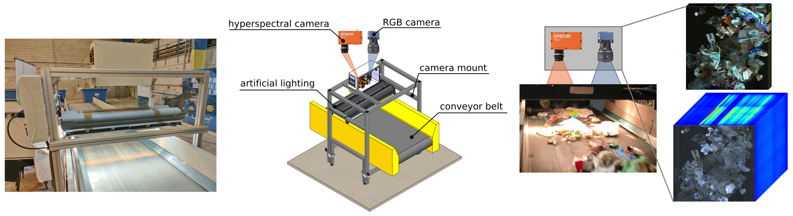

# SpectralWaste Dataset: Multimodal Data for Waste Sorting Automation

<p align=center>

</p>

<p align=center>
    <a href="https://www.linkedin.com/in/sara-casao-martinez-5b49b9180">Sara Casao</a><sup>1,*</sup>
    <a href="https://www.ferpb.com">Fernando Peña</a><sup>1,*</sup>
    <a href="https://sites.google.com/unizar.es/alberto-sabater/">Alberto Sabater</a><sup>1</sup>
    <a href="https://www.linkedin.com/in/rosacastillon">Rosa Castillón</a><sup>2</sup>
    <a href="https://webdiis.unizar.es/~dario/">Darío Suárez</a><sup>1</sup>
    <a href="https://sites.google.com/unizar.es/eduardo-montijano">Eduardo Montijano</a><sup>1</sup>
    <a href="https://sites.google.com/unizar.es/anac">Ana C. Murillo</a><sup>1</sup>
</p>

<p align=center>
<sup>1</sup>Universidad de Zaragoza
<sup>2</sup>ATRIA Innovation
<br>
<sup>*</sup>equal contribution
</p>

<p align=center>
<a href="https://arxiv.org/pdf/2403.18033"></a>
<a href="https://sites.google.com/unizar.es/spectralwaste"></a>
<a href="https://zenodo.org/records/10880544"></a>
</p>

## Installation
The repository requires Python 3.9+ and compatibility with PyTorch 2.0+ and `torchvision` 0.16+.

You can install the code in a virtual environment running:

```
python -m venv .venv
source .venv/bin/activate
pip install -U pip
pip install -e .
```

## Dataset

This code uses a preprocessed version of the raw [SpectralWaste dataset][spectralwaste-dataset]. The preprocessing steps include aligning the modalities, downsampling, generating labels for the hyperspectral images, dividing the data into splits and creating dimensionality-reduced versions of the images. You can directly download the preprocessed dataset used in the experiments (23 GB) from [Zenodo][preprocessed-labeled-zenodo] or [OneDrive][preprocessed-labeled-onedrive].

Additionally, you can download the unlabeled images preprocessed in the same way (178 GB) from [OneDrive][preprocessed-unlabeled-onedrive].

[spectralwaste-dataset]: https://github.com/ferpb/spectralwaste-dataset
[preprocessed-labeled-zenodo]: https://zenodo.org/records/10880544
[preprocessed-labeled-onedrive]: https://unizares-my.sharepoint.com/:u:/g/personal/756012_unizar_es/EVJygVCmvs1BrCvA_WEtcIcBkUGbgsmN4fLaWGwr_lLJBw?e=lSPWxs
[preprocessed-unlabeled-onedrive]: https://unizares-my.sharepoint.com/:u:/g/personal/756012_unizar_es/Ea5ec2LtwoVOjlKfobsqbwsBTsgQMbIcnh_p0YbQvEH36A?e=vu4BHh

## Evaluation

We provide [here][checkpoints] the checkpoints used in the paper. To evaluate these models, run the following command indicating the location of the preprocessed dataset and the path to the checkpoint to load:

```
python scripts/train_model.py --data-path path/to/dataset --resume path/to/checkpoint.pth --test-only
```

The `scripts/dim_reduction.py` script generates a dimensionality reduced version of the hyperspectral images. To use it, indicate the path to the hyperspectral images and the reduction configuration:

```
python scripts/dim_reduction.py --data-path path/to/dataset/hyper --reduction-method pca --num-components 3
```

It will create a new directory with the format `path/to/dataset/hyper_<reduction_model><num_components>`.

[checkpoints]: https://unizares-my.sharepoint.com/:f:/g/personal/756012_unizar_es/Ej1qFSZwxbxKt2XqUxLGumUBo2hRf0HBm0ULXySu4DYJQA?e=9QUaPs

## Training

To train a new version of the models, run `scripts/train_model.py` with the following arguments:

* `--data-path PATH`
* `--results-path PATH`
* `--model {mininet, mininet_multimodal, segformer_b0, segformer_b0_multimodal, cmx_b0}`
* `--input-mode {rgb, hyper, hyper_pca3}`
* `--target-mode {labels_rgb, labels_hyper_lt}`

For the multimodal models, you can indicate two input modalities separated by a comma, e.g., `rgb,hyper_pca3`.

For example, to train CMX-B0 using both RGB and hyperspectral modalities supervised with the RGB labels run:

```
python train_model.py --data-path PATH --model cmx_b0 --input-mode rgb,hyper --target-mode labels_rgb --max-epoch 200
```

You can add the `--wandb PROJECT` option to log the training results to a Weights and Biases project named `PROJECT`.

## Visualization

The `notebooks` directory contains Jupyter notebooks to visualize the data and the segmentataion results. They assume that both the dataset and the checkpoints are stored in a `data` directory in the root of the repo.